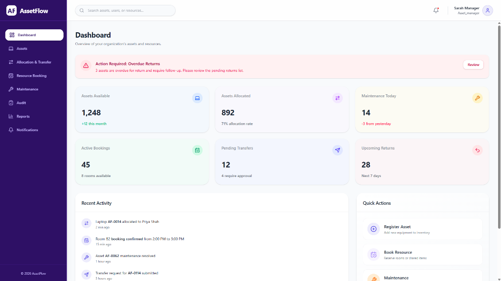
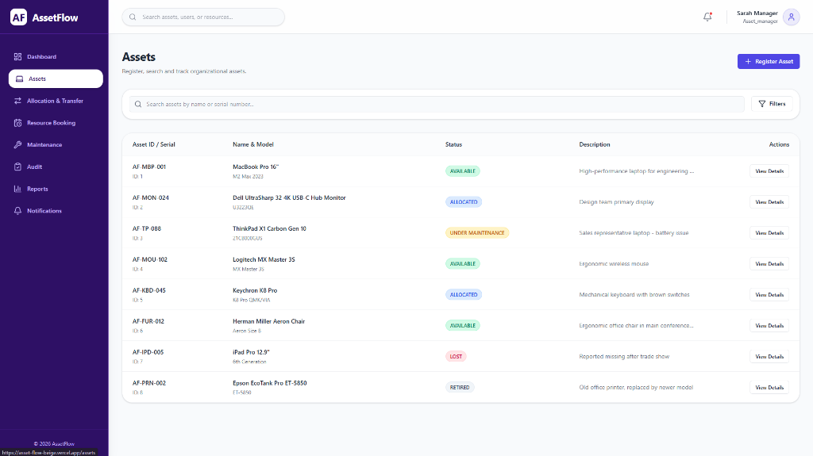
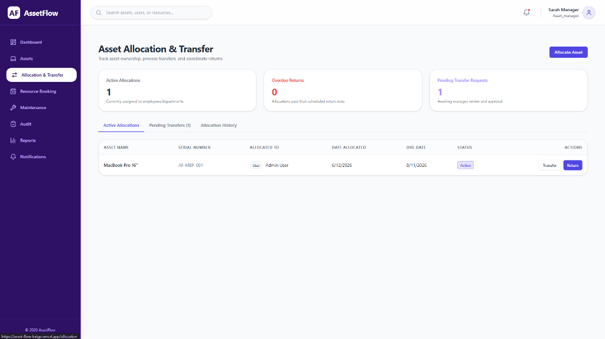
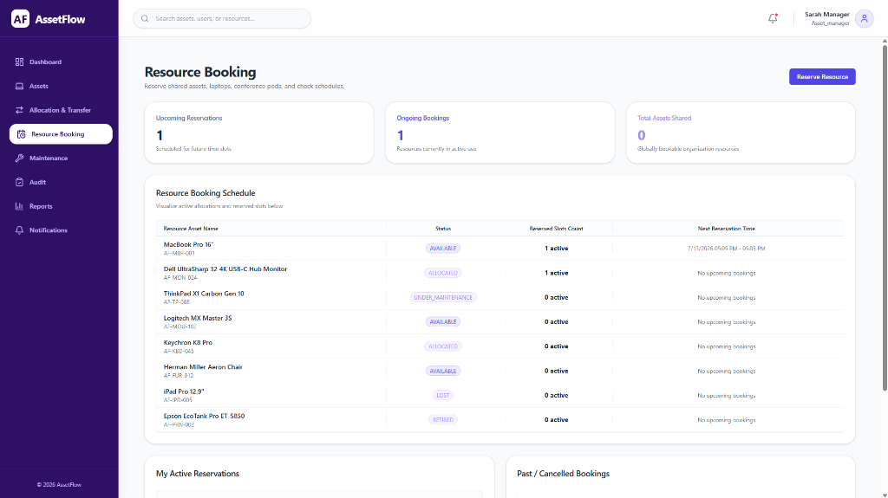
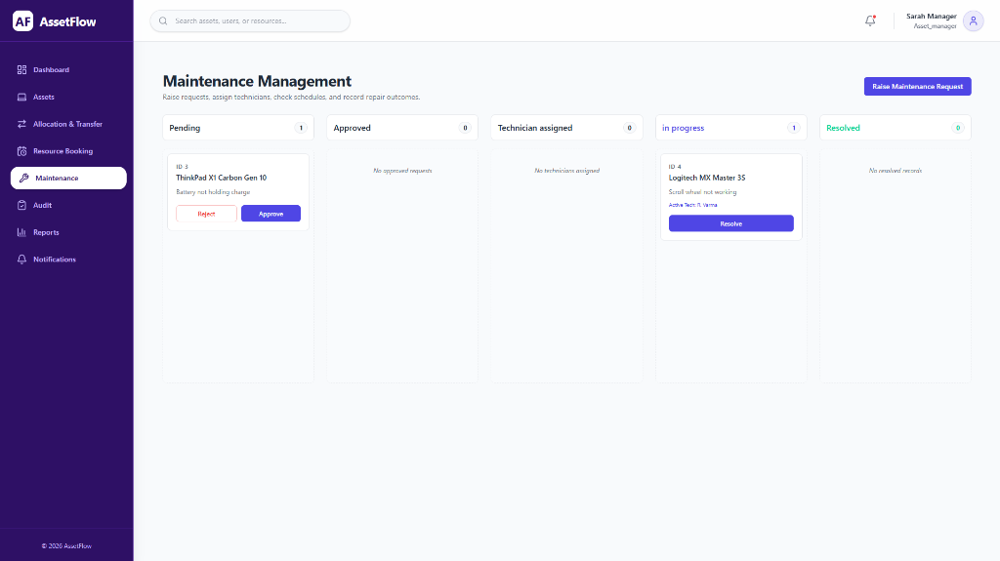
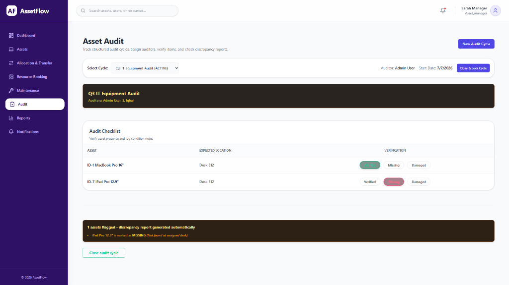
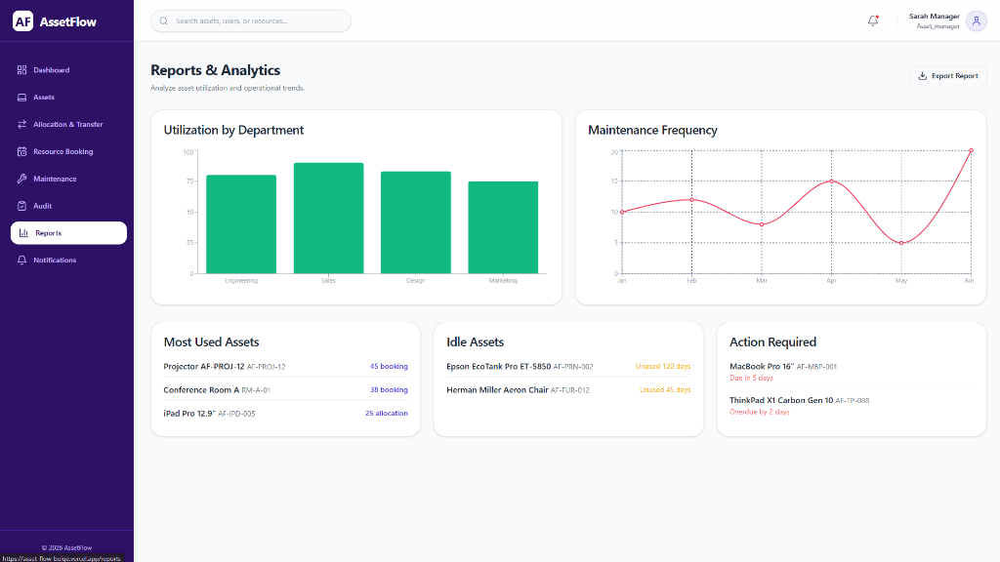
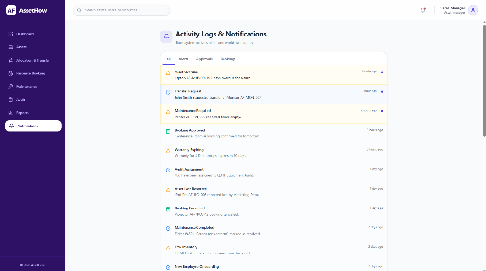

# AssetFlow - Enterprise Asset & Resource Management System

AssetFlow is a robust, full-stack application built for the Odoo Hackathon. This repository contains the foundational architecture.

# 📸 Application Screenshots

Below are screenshots demonstrating the key features and user interface of the AssetFlow Enterprise Asset & Resource Management System.

### 📊 Dashboard
Centralized command center providing real-time insights into asset allocation, maintenance requests, and active resource bookings.



### 📦 Asset Directory
A powerful searchable and filterable grid displaying all organizational assets along with their current status and assignment.



### 🔄 Asset Allocation
Dedicated workflow for checking out assets to employees or departments, complete with tracking for due dates and conditions.



### 📅 Resource Booking
Interactive scheduling system allowing staff to reserve shared resources like conference rooms or specialized equipment.



### 🛠️ Maintenance Management
End-to-end ticketing system for reporting issues, assigning technicians, and tracking repair resolutions.



### ✅ Asset Audit
Compliance-focused module for conducting periodic physical inventory checks and verifying asset locations.



### 📈 Reports & Analytics
Advanced reporting engine generating comprehensive visual summaries of asset utilization, depreciation, and lifecycle metrics.



### 🔔 Notifications
Real-time alerts keeping users informed about pending approvals, maintenance updates, and upcoming reservation times.


### 📜 Activity Logs
Immutable audit trail recording every critical action within the system for maximum accountability and security tracking.



## Tech Stack
- **Frontend:** React, Vite, Tailwind CSS, TypeScript
- **Backend:** FastAPI, Python, SQLAlchemy
- **Database:** PostgreSQL
- **Auth:** JWT, Role-Based Access Control (RBAC)

## Project Structure
- `/backend`: FastAPI Python backend architecture.
- `/frontend`: React frontend architecture.

## Getting Started

### Docker (Recommended)
You can start the entire stack with a single command using Docker:
```bash
docker compose up --build
```
After startup, the services will be available at:
- **Frontend**: http://localhost:5173
- **Backend API**: http://localhost:8000
- **Swagger API Docs**: http://localhost:8000/docs
- **PostgreSQL**: localhost:5432

### Local Setup (Without Docker)

#### Backend Setup
1. `cd backend`
2. Create virtual environment: `python -m venv venv`
3. Activate virtual environment (Windows): `.\venv\Scripts\activate`
4. Install dependencies: `pip install -r requirements.txt`
5. Copy `.env.example` to `.env` and fill in DB credentials.
6. Run server: `uvicorn app.main:app --reload`
   - API Docs: http://localhost:8000/api/v1/docs

### Frontend Setup
1. `cd frontend`
2. Install dependencies: `npm install`
3. Run development server: `npm run dev`
   - App URL: http://localhost:5173

## Core Features Implemented in Foundation
- Professional FastAPI folder structure (API, Core, CRUD, DB, Models, Schemas).
- Professional React folder structure (Components, Context, Pages, Routes, Services, Types).
- Custom Tailwind CSS theming matching dark mode aesthetic.
- Global Layouts, Sidebar, Navbar.
- Protected Routes with Role Based Access Control (`admin`, `asset_manager`, `department_head`, `employee`).
- Axios interceptors for global JWT injection and error handling.
- Reusable UI Components (Button, Input, Card).
- Auth system ready to connect to FastAPI JWT.


---
